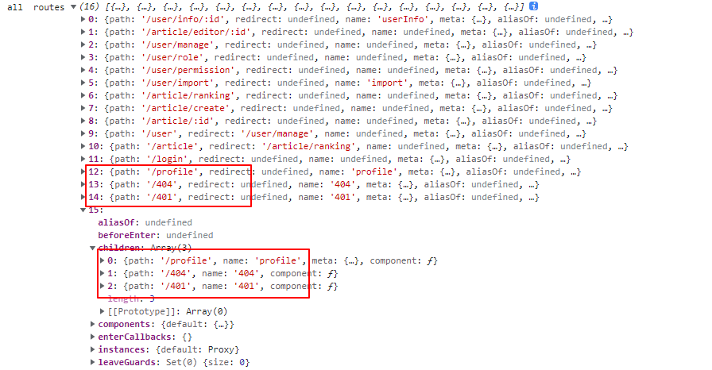

## side bar  menu

左侧的菜单一般使用routes循环得到的

vue-router 

- router.options.routes  这个得到的是路由初始路由列表
- router.getRoutes  获取所有 路由记录的完整列表。

1. 由于动态添加路由的可能性，使用 getRoutes 方法获取所有路由
2. 并不是所有路由都需要放在菜单上，路由添加meta.icon meta.title 字段，meta && meta.title && meta.icon 成立才展示到menu
3. 组件方面 使用element plus

```html
<el-menu>
  <el-sub-menu index="1">
      <template #title>navigation one</template>
      <el-menu-item index="1-1">item one</el-menu-item>
      <el-menu-item index="1-2">item two</el-menu-item>
  </el-sub-menu>
   <el-menu-item index="2">navigation two</el-menu-item>
</el-menu>
```

## 处理 Router.getRoutes()

getRoutes 返回的数据会有重复，并不适合menu数据循环


按这个结构，我们需要把一级路由里面为其它路由的子路由的 移除

```javascript
// 只适应二级嵌套路由
const filterRouter = routes => {
  const childrenRoutes = getChildrenRoutes(routes)
  // 一级路由的path 如果有children里面存在，则需要剔除
  return routes.filter(route => {
    return !childrenRoutes.some( childrenRoute => {
        return childrenRoute.path === route.path
    })
  })
}

// 其实就是拿routes.children 的值
const getChildrenRoutes = routes => {
  const result = []
  routes.forEach(route => {
    if (route.children &&  route.children.length > 0) {
      result.push(...route.children)
    }
  })
  return result
}


const isNull = (val) => {
  if (val !== 0 && !val) return true
  if (JSON.stringify(val) === "{}") return true 
  if (JSON.stringify(val) === "[]") return true
  
  return false

}

// 构造menu列表，需要满足  route.meta && route.meta.icon && route.meta.title 的路由才显示在菜单中
// 传入的是过滤后的路由
export const generateMenus = (routes) => {
  const result = []

  routes.forEach((route) => {
    if (isNull(route.meta) && isNull(route.children)) return
    // 没有meta 但有children的也要递归
    if (isNull(route.meta) && !isNull(route.children)) {
      result.push(...generateMenus(route.children))
      return
    }
    // 有meta 也有children的二级路由
    if (route.meta.title && route.meta.icon) {
      if (route.children) {
        route.children = generateMenus(route.children)
      }
      result.push(route)
    }
  })

  return result
}


// 考虑到路由分离后，可能会存在同名父路由情况，需要处理
route.children.push(...generateMenus(route.children))

// 处理子路由不是/开头的情况
generateMenus(routes, basePath = '')

```


## js css 共享变量

1. 定义scss变量，导出到js即可使用
2. js定义变量  在css里面可以使用v-bind(xxx)  [文档](https://vuejs.org/api/sfc-css-features.html#v-bind-in-css)


## vue3 不template 不现需要用一个根节点


menuItem.vue 因为习惯用一层div包起来，导致element plus的某些css样式无法渲染


